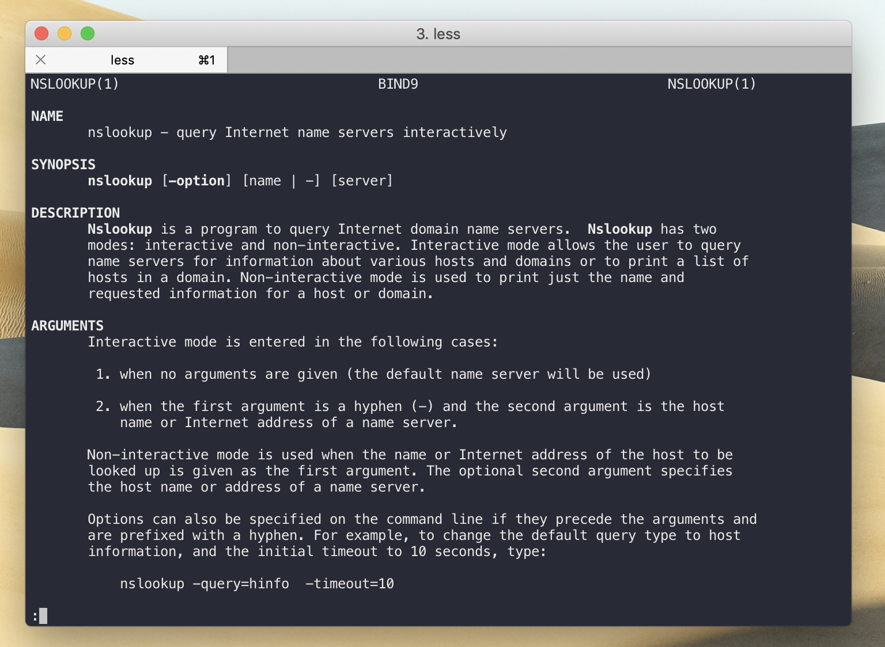

## Markdown
---

**What is Markdown**

"Markdown allows you to write using an easy-to-read, easy-to-write plain text format, then convert it to structurally valid XHTML (or HTML)" [source](https://readwrite.com/2012/04/17/why-you-need-to-learn-markdown/). You will be expected to use this syntax for most of your class reports. You will find a file called `README.md` in the root of all of your GitHub repo folders. This is where you will be doing most of your markdown work.

 

**How do I get started?**

Don't worry if you are unfamiliar with Markdown, it's really easy to pick up. Github has great documentation on all of the things you can do with it here: [ mastering-markdown](https://guides.github.com/features/mastering-markdown/) guide. Once you've taken a look at it follow this beginner's tutorial: [markdowntutorial.com](https://www.markdowntutorial.com/).

 

**Additional advice**

When you're editing your `md` file in your computer, you'll want to know how your text would look like on Github as you're typing. I reccomend installing a couple extensions on VS code in order to make your life easier: `Markdown Preview Github` and `Markdown All in One`.

Each has instructions at the time of installation on how to use them.

 
 

## Bash
---

> Bash command, terminal command, command line command, for the purpose of our class these all mean the same things. You should already be familiar with bash from INFO 201 and INFO 340. This following section will help you refresh some of the basics.

 

**Command documentation**  
If you don't know what a command does or how to use it simply use the `man` command! 
`man <commandName>` will print out an documentation. Once you're done reading hit `q` on your keyboard to quit out.  In the following screenshots I enter `man nslookup` which provides me with more information on what `nslookup` does and how it's used.

 

**Directories**

* `cd` to change directories
* `ls` to show files and directories at your current path
  * `ls -a` to also show hidden files

 

**Editing files** 

If you are editing a file on a remote server such as your Pi, you will not have the luxury of using a nice editor such as VS Code, Atom, or Sublime. Nevertheless, there are many powerful terminal editors.
Use `nano` or `vim` to edit files through your terminal.

How to edit a file that's on a linux server/your Pi:

- Use `nano <fileName>` or `vim <filename>`
- Nano is beginner friendly. 
If you are unfamiliar with these I recommend looking up a nano tutorial.

 

**Logs**  
Check the last 100 lines of a service's logs. This is a great way to see if it ran into any errors. 

* `sudo journcalctl -u <service name>`
* If you specficially only want to see the most recent parts of the log you can pipe the information it gives you into the tail command, which only shows any files' ending lines. `sudo journalctl -u <service name here>.service | tail -n 100`

 

**Services**  
Control services by using the `systemctl` command.
* Restart services: `sudo systemctl restart <service name>`
* See whether a service is running or not:`sudo systemctl status <service name>`

 

**Copy files**  
You can copy files from your laptop to a server or a server to your laptop by using `scp`.  
It uses our ssh tunnel to securely transfer your files back and forth. You can find great examples at [hyperx.org](http://www.hypexr.org/linux_scp_help.php).