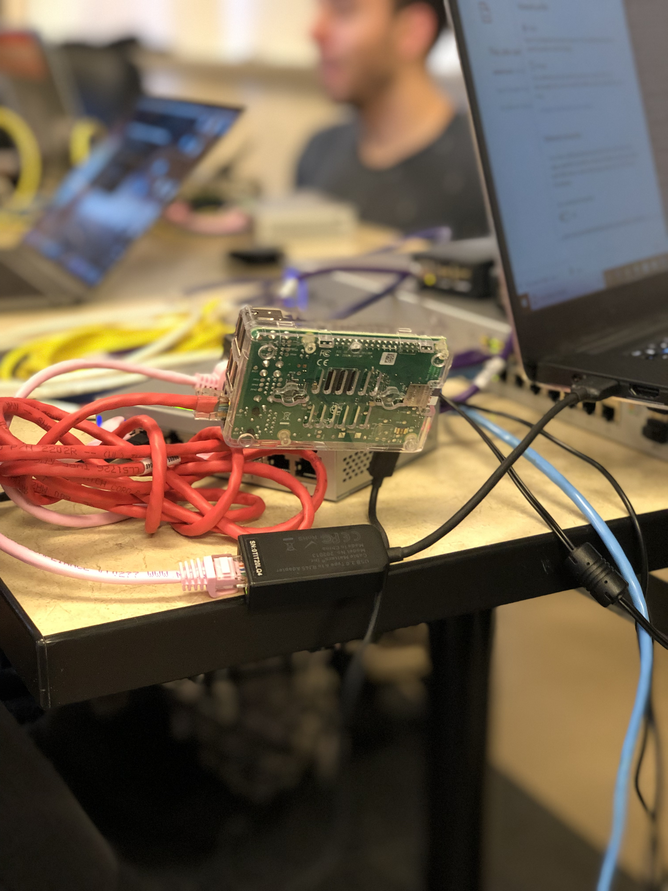

> By the time you have arrived to the final project, debugging will involve narrowing down at what stage something is failing at, and then investigating that specific tool

## No Internet

* `ifconfig`, are you assigning your Pi the correct new address, make sure it's not your network address.